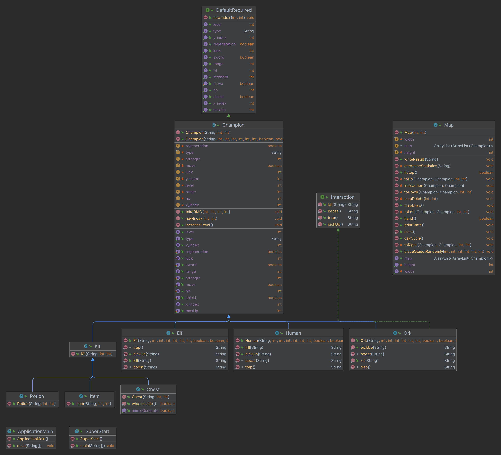

# SymulatorPolaBitwy-OOP-project

## Temat Projektu : „Symulator Pola Bitwy”

### Skład grupy projektowej:

1. **Patryk Pietrzyk** ( Lider )
2. **Mikołaj Lipiński**
   
### Strona:
[***Strona dokumentacji wygenerowana z JavaDoc !***](https://taki-sobie-typ.github.io/JavaDoc-For-SymulatorPolaBitwy-OOP-project/)

## Opis zadania:
Bitwa odbędzie się na polu utworzonym z macierzy 12x12 i będzie przebiegać między trzema
rasami: ludźmi, elfami i orkami. Dzień będzie kończył się w momencie w którym każda z
postaci na mapie wykona swoje posunięcie. Zwykle poruszanie będzie polegało na
przemieszczeniu o jedną kratkę w danym kierunku. Wyjątkiem będzie niskie zdrowie
bohatera, który będzie potrzebował chwile czasu aby odpocząć i zregenerować swoje punkty
życia. Każda z ras będzie charakterystyczna na swój sposób. Ataki ludzi wręcz może i nie
będzie bardzo efektywna lecz ich siłą będzie liczebność i wysokie szczęście pozwalające
atakować im zawsze jako pierwsi. Rasa elfów wykaże się zwinnością z doświadczenia
spędzonego w lesie. Podczas walki z przeciwnikiem elf będzie miał szansę na ucieczkę z walki
gdy jego punkty życia znacznie spadną. Poruszanie elfów również jest imponujące, gdyż mają
oni szanse na poruszenie się o dwie kratki w danym kierunku. W naszym zestawieniu nie
mogło zabraknąć potężnych orków i mimo, że ich liczebność i szczęście nie są imponujące to
moc ich uderzenia i zwiększanie swojego levelu w szybkim czasie sprawia, że pozostałe rasy
czują niepokój przed spotkaniem twarzą w twarz. Podczas, gdy bohater spotka innego z innej
rasy na miejscu do którego miał zrobić ruch odbędzie się walka w której zaczyna bohater z
wyższym szczęściem i zabiera przeciwnemu bohaterowi tyle życia ile ma sam ataku.
Przeciwnik robi to samo i walka kończy się w momencie w którym zostanie jeden z nich na
danym polu (Walka na śmierć i życie). W tak zaciętej wojnie ras nie może zabraknąć
przedmiotów losowo rozmieszczonych na mapie takich jak mikstury zdrowia duża jak i mała
przywracająca daną ilość życia , skrzynki z dodatkowymi ulepszeniami do statystyk, a może
pułapką która zabierze życie oraz wyposażeniem które pozwoli przyodziać wojownika w
miecz zwiększający atak lub tarczę na zablokowanie pierwszego kolejnego ataku. Gra kończy
się w monecie kiedy jedna rasa całkowicie zdominuje plansze gry.

## Diagram Klas:

## Diagram Obiektów:

